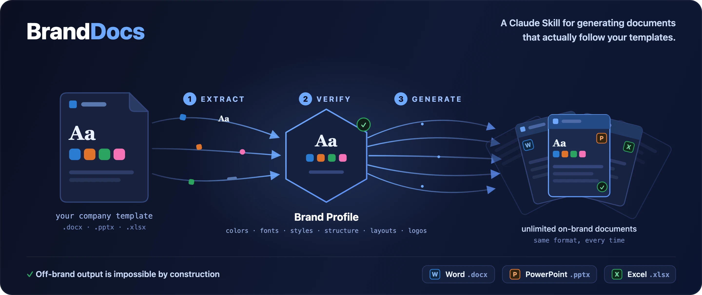

<div align="center">



<br/>

# SASdocX: AI On-Brand Document Generator for Word, PowerPoint & Excel

**SASdocX is a set of agent skills that learn your existing Word, PowerPoint and Excel templates and generate new on-brand documents from them.** Unlike generic AI document generators, it preserves **brand, structure, styles and formulas by construction**. Built for Claude Code, Codex and compatible AI agents.

[](LICENSE)
[](https://www.python.org/)
[](#the-three-skills)
[](#project-status)

> **SASdocX** is the SAS-AM rebrand of the MIT-licensed [`brand-docs`](https://github.com/ferdinandobons/brand-docs) engine by Ferdinando Bonsegna. It ships inside the SASAMClaudeCodeSkills marketplace.

</div>

---

## What is SASdocX?

**SASdocX** is an open-source **agent-skill bundle** that learns a company's existing Office templates and generates new on-brand documents from them. Point it at one branded `.docx`, `.pptx`, or `.xlsx`; it **extracts** the brand (theme colors and fonts, named styles, the document's *structure*, layouts, cover anchors, logos and tables) into a portable **Brand Profile**. From then on, every document it **generates** is built *from the original template shell* and uses *only* the artifacts the template actually defines. Each format stays in its own lane: there is no cross-format conversion.

> **The core guarantee: off-brand output is impossible by construction.** No generator ever writes a literal style name, hex color, or font: those live only in the Brand Profile, and `verify` refuses a profile that points at anything the template doesn't contain.

### At a glance

| Question | Answer |
|---|---|
| **Input** | Existing company `.docx`, `.pptx`, or `.xlsx` templates |
| **Output** | Same-format on-brand Word documents, PowerPoint decks, and Excel workbooks |
| **Works with** | Claude Code, Codex, compatible AI agents, or the direct Python CLI |
| **Best for** | Repeatable reports, decks, workbooks, proposals, memos, briefs, and internal document workflows |
| **Privacy model** | Local-first; no cloud service is required, and real templates are git-ignored |
| **Speed** | First run on a new template: up to ~15 min end to end (extract + model comprehension + visual QA); every later document from the saved profile: seconds |
| **Current release** | v0.10.0 alpha (vendored into SASAMClaudeCodeSkills) |

---

## The three skills

| Skill | Format | Generates |
|---|---|---|
| **`sasdocx`** | Word `.docx` | reports, letters and memos in the template's structural order |
| **`saspptx`** | PowerPoint `.pptx` | decks from the template's real masters & layouts, with native charts, diagrams & merged tables |
| **`sasxlsx`** | Excel `.xlsx` | workbooks: named-region fills with **formulas preserved** and brand number formats |

All three share one engine and expose the same verbs: **`extract` → `comprehend` *(optional, model-driven)* → `verify` → `generate`**, plus the learning verbs **`learn` / `propose-overrides` / `refine`** that fold QA findings and user feedback back into the profile. Details → [documentation/SKILLS.md](documentation/SKILLS.md).

**Several templates, one brand?** `extract --blend` folds a second same-format template into a saved profile at the value-fact level: it fills gaps and corroborates agreements, the primary template wins every conflict, and the brand guarantee is untouched because artifact pointers never cross templates. `compare-profiles` reports brand drift (theme colors, fonts, off-theme usage) between any two saved profiles and exits non-zero on drift, so it can gate brand coherence in CI.

**Two-phase by design:** the deterministic engine works with **no model at all** (extract / verify / generate, fully offline); the model-assisted verbs sit ON TOP and can only NAME captured facts - every proposal is validated fail-closed, so the brand guarantee never depends on a model being right.

---

## Prerequisites

SASdocX runs locally and needs a few things installed **before first use**:

- **Python ≥ 3.10** plus the packages in [`requirements.txt`](requirements.txt) (`python-docx`, `python-pptx`, `openpyxl`, `lxml`, `Pillow`):
  ```bash
  pip install -r requirements.txt
  ```
- **Visual QA tools (keep the visual gate on):** the render-based **visual QA gate runs by default** and catches layout problems the deterministic checks can't (text overflow, blank pages, clipping, stale demo text). It needs LibreOffice + Poppler (Tesseract is optional, for OCR). Install them with one auto-detecting command:
  ```bash
  bash scripts/setup_visual_qa.sh
  ```
  Generation still runs without them (it degrades gracefully to deterministic-only QA, level L0), but install them so the visual gate stays on.

Check what's present at any time with `python scripts/cli.py doctor`. Per-OS commands and the full setup → **[documentation/INSTALLATION.md](documentation/INSTALLATION.md)**.

---

## Installation

The three skills share one Python engine (`scripts/sasdockit/`), so install the **whole repository** (copying a single skill folder on its own won't work). After either install below, set up the [prerequisites](#prerequisites) so the engine can run, then verify with `python scripts/cli.py doctor`.

### Claude Code (via the SASAMClaudeCodeSkills marketplace)

SASdocX is registered in the SAS-AM marketplace, which loads all three skills plus the shared engine together:

```text
/plugin marketplace add scrivo21/SASAMClaudeCodeSkills
/plugin install sasdocx@SASAMClaudeCodeSkills
```

If you cloned the SASAMClaudeCodeSkills repo locally, `./setup.sh` also registers `/sasdocx`, `/saspptx` and `/sasxlsx` as slash commands.

### Codex (and other agents)

Clone the marketplace and symlink the three skills into your Codex skills directory, so each skill's engine in `scripts/sasdockit/` travels with it:

```bash
git clone https://github.com/scrivo21/SASAMClaudeCodeSkills.git ~/.codex/SASAMClaudeCodeSkills
cd ~/.codex/SASAMClaudeCodeSkills/sasdocx/0.10.0 && python3 -m venv .venv && . .venv/bin/activate && pip install -r requirements.txt
mkdir -p ~/.codex/skills
for s in sasdocx saspptx sasxlsx; do ln -s ~/.codex/SASAMClaudeCodeSkills/sasdocx/0.10.0/skills/$s ~/.codex/skills/$s; done
```

Restart or reload the agent if the skills don't appear immediately.

> Engine details and updating instructions are in **[documentation/INSTALLATION.md](documentation/INSTALLATION.md)**.

---

## Quick start

**With an AI agent** (the intended experience). Describe what you want and attach a template:

> "Use this company Word template and write a report on the history of Napoleon."

The agent activates `sasdocx`, extracts (or reuses) a Brand Profile, fills the template shell in its structural order, runs QA, and returns the file. PowerPoint (`saspptx`) and Excel (`sasxlsx`) work the same way.

**How long does it take?** The FIRST run on a new template is the slow one: extraction, the optional model comprehension, content authoring and the visual QA gate (plus any repair round) can take up to ~15 minutes end to end with an AI agent. Every later document from the saved profile takes seconds. Still a fraction of formatting the document by hand, and you get a faithful file instead of an approximate one.

**Direct CLI** (the engine, for tests & debugging). No template at hand? Try the
shipped synthetic example: `examples/templates/sasdocx_template.docx` (also
`.pptx` / `.xlsx`).

```bash
# 1) Extract the brand from a template into a reusable Brand Profile
python scripts/cli.py extract --name <your_company> --template examples/templates/sasdocx_template.docx --scope project

# 2) Verify the profile (fails if a role points at a missing artifact)
python scripts/cli.py verify --name <your_company> --scope auto --qa auto

# 3) Generate a new on-brand document from structured content
python scripts/cli.py generate --name <your_company> --input idoc.json --output out.docx --scope auto --qa auto
```

The input (`idoc.json`) is an **IntermediateDocument** of brand-agnostic typed blocks (no styles, colors or fonts); the Brand Profile resolves all of that.

---

## Project status

**Alpha, maturing.** Stability is per format: **Word (`sasdocx`) is robust** - the reference implementation, verified end-to-end on real templates with a 900+ test suite, three QA lanes and frozen byte-identity anchors; **PowerPoint and Excel share the engine** and are catching up to docx parity. The profile schema (1.2.0) is frozen and additive: profiles keep working across releases. Full status table → [documentation/SKILLS.md](documentation/SKILLS.md#project-status).

## Documentation

- Full engine documentation: [`documentation/`](documentation/)
- Per-skill contracts: [`skills/sasdocx`](skills/sasdocx), [`skills/saspptx`](skills/saspptx), [`skills/sasxlsx`](skills/sasxlsx)

## Changelog

Engine release v0.10.0. See [CHANGELOG.md](CHANGELOG.md) for the upstream engine history.

## License, citation & acknowledgements

- SASdocX is the SAS-AM rebrand of **[`brand-docs`](https://github.com/ferdinandobons/brand-docs)**, used and redistributed under the **[MIT License](LICENSE)** © 2026 Ferdinando Bonsegna. The original copyright and license are retained in full — see [`LICENSE`](LICENSE) and [`NOTICE`](NOTICE).
- Self-contained: the OOXML engine is re-implemented from scratch; it does **not** vendor any proprietary or third-party Office tooling.
- Original engine citation → [`CITATION.cff`](CITATION.cff).
